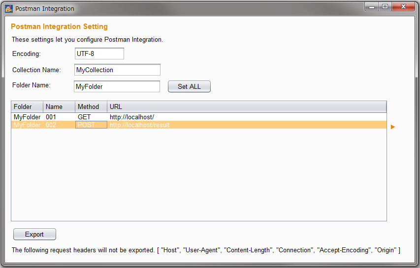

  

# POSTMAN Collaborator
POSTMAN Collaborator is an extension to generate **POSTMAN fomat json file**.

# Usage

* It's very easy. You can open POSTMAN Collaborator window from context menu on history tab. Multiple selection is OK!. Then  set up the followings on the window.

  * **Encoding** - This is encoding.
  
  * **Collection Name**: - Collection name which you want to name in POSTMAN.

  * **Folder Name**: - Folder name which you want to name in POSTMAN. You may use "Set ALL" button to set folder name to the field "Folder" for all of requests.

  * **Name**: - Request name which you want to name in POSTMAN.

* Once you press **Export** button, this generate POSTMAN format json file. **You can import it into POSTMAN**.

## License
MIT
